# karpenter-provider-rafay — Architecture

> **Confluence note:** Diagrams in this document use Mermaid syntax. Render them with the **Mermaid Diagrams for Confluence** app, or paste each block into [mermaid.live](https://mermaid.live) to preview.

---

## Table of Contents

1. [Overview](#1-overview)
2. [System Architecture](#2-system-architecture)
3. [Component Descriptions](#3-component-descriptions)
4. [Data Flows](#4-data-flows)
5. [Core Packages](#5-core-packages)
6. [Worker Node SKU Catalog](#6-worker-node-sku-catalog)
7. [Operation State Machine](#7-operation-state-machine)
8. [NodeClaim Registration Timeline](#8-nodeclaim-registration-timeline)
9. [Identity and Security](#9-identity-and-security)
10. [Provider ID Format](#10-provider-id-format)
11. [Idempotency and Resilience](#11-idempotency-and-resilience)
12. [Timeouts Reference](#12-timeouts-reference)
13. [Configuration Reference](#13-configuration-reference)
14. [Key Dependencies](#14-key-dependencies)
15. [Design Decisions](#15-design-decisions)

---

## 1. Overview

`karpenter-provider-rafay` integrates Karpenter's scheduling engine with Rafay's private-cloud infrastructure layer. It is **not** a public cloud provider — there are no AWS/GCP/Azure API calls. Node-add **and** node-remove requests are batched and forwarded to the **edge-broker** over mTLS gRPC on a single protocol: `KarpenterBatchService.BatchStreamOperations`.

### Key Properties

| Property | Detail |
|---|---|
| **Add protocol** | `KarpenterBatchService.BatchStreamOperations` `batch_add` — up to 10 nodes per batch, 10 s collection window |
| **Remove protocol** | Same stream, `batch_remove` frame — removes share the batcher with adds, sent as separate batches |
| **Cancel protocol** | Same stream, `cancel_ops` frame — best-effort cancel of operations still queued (ACCEPTED) at the broker |
| **Transport security** | mTLS — client certificate required; edge identity derived from cert Subject O. Batch operations **cannot** be served over a plaintext listener (no client cert → no edge id) |
| **State store (broker)** | Redis — per-op records (15-min TTL while ACCEPTED, 60-min once RUNNING/FAILED, **24-h tombstone once SUCCEEDED**) + per-batch index (90-min TTL). Every record is scoped to the authenticated `edge_id` |
| **Provisioning backend** | `WorkspaceComputeInstance` via `WorkspaceRPCService` (paas-api) — declarative pool+SKU counts |
| **Idempotency key** | Add: `NodeClaim.UID` · Remove: `NodeClaim.UID + "-remove"` — prevents duplicate catalog mutation on retry |
| **Removal granularity** | Catalog **count decrement** per pool+SKU — the PaaS platform chooses which physical machine is removed (`provider_id` is carried for a future targeted-removal API) |
| **ProviderID resolution** | `NodeProviderIDController` patches real `spec.providerID` once the node joins the cluster |
| **Pre-existing nodes** | `NodeAdoptionController` creates a NodeClaim per unclaimed worker node in a pool (no broker call), so the pool's original nodes count towards its limits and can be consolidated |
| **Failure recovery** | Status poller reports broker-side FAILED ops to a failure handler that deletes the still-pending NodeClaim, so Karpenter reprovisions in seconds instead of waiting out the 60-min registration timeout |
| **Removal completion** | Status poller records broker-side SUCCEEDED ops; `Delete()` returns `NodeClaimNotFoundError` once the remove op has SUCCEEDED — the only signal that releases the Node's termination finalizer |
| **Source of truth** | NodeClaims in etcd — no in-memory state is load-bearing across pod restarts |

### High-Level Architecture

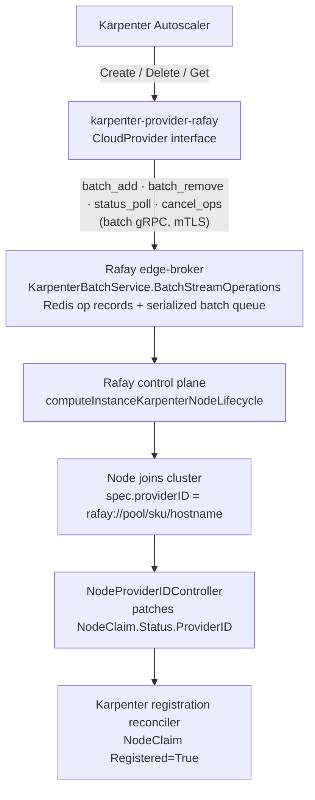

---

## 2. System Architecture

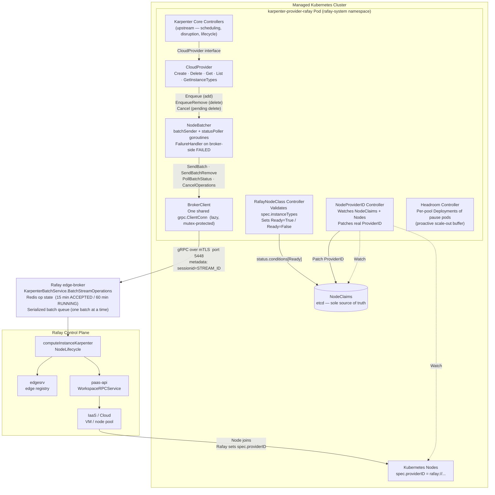

---

## 3. Component Descriptions

### 3.1 In-Cluster Components

| Component | Package | Responsibility |
|---|---|---|
| **CloudProvider** | `pkg/cloudprovider` | Implements `Create`, `Delete`, `Get`, `List`, `GetInstanceTypes`. `Create` picks the **cheapest compatible** instance type (synthetic price), blocks until broker ACK, then returns a synthetic pending ProviderID. `Delete` enqueues a batch remove, returns at broker ACK, and is re-invoked by Karpenter every 5 s until the broker reports the removal SUCCEEDED — at which point it returns `NodeClaimNotFoundError` and the Node's finalizer is released. |
| **NodeProviderIDController** | `pkg/controllers/nodeproviderid` | Watches NodeClaims with `rafay://pending/` ProviderID and real Rafay nodes. Patches real ProviderID once node joins. Single-threaded (`MaxConcurrentReconciles: 1`). |
| **NodeAdoptionController** | `pkg/controllers/nodeadoption` | Creates a NodeClaim for each worker node the platform built **before** Karpenter ran (labelled `nodepoolname`/`sku_name` but unclaimed), filling in `spec.providerID` when it is empty. Without it a pool's pre-existing nodes count for nothing — Karpenter provisions on top of its own `limits` and can never consolidate them. The NodeClaim carries `karpenter.rafay.io/adopted-provider-id`, which makes `Create()` return that ProviderID instead of asking the broker for a machine. Single-threaded (`MaxConcurrentReconciles: 1`); disabled by `KARPENTER_ADOPT_EXISTING_NODES=false`. |
| **BrokerClient** | `pkg/rafay/brokerclient.go` | One shared `*grpc.ClientConn`; every RPC carries a 30 s deadline. `SendBatch`/`SendBatchRemove` are never retried (`callBrokerOnce`); `PollBatchStatus`/`CancelOperations` retry once on `Unavailable` (`callBroker`). |
| **NodeBatcher** | `pkg/rafay/batcher.go` | Collects `Create()`/`Delete()` requests into batches (up to 10 / 10 s, adds and removes partitioned), sends via `SendBatch`/`SendBatchRemove`, unblocks callers at broker ACK, polls via `PollBatchStatus`. Deduplicates retries by `operationID`. FAILED results invoke the registered `FailureHandler`. |
| **RafayNodeClass Controller** | `pkg/controllers/rafaynodeclass` | Validates `spec.instanceTypes` (non-empty, names set, cpu/memory quantities parse). Valid → `Ready=True`; invalid → `Ready=False` with reason `ValidationFailed`, which blocks the NodePool readiness gate. |
| **Headroom Controller** | `pkg/controllers/headroom` | Maintains one Deployment (`headroom-<pool>`) of low-priority pause pods per pool configured in the `headroom-policy` ConfigMap, keeping a preemptible capacity buffer that triggers proactive scale-out. Watch-driven (ConfigMap/Node/Deployment events) with a 5-min resync. |
| **RafayNodeClass CRD** | `pkg/apis/v1alpha1` | Cluster-scoped CRD defining available instance types (`spec.instanceTypes`) — and nothing else. It carries no Rafay cluster/project identity; that comes only from the controller's `RAFAY_CLUSTER_ID` / `RAFAY_PROJECT_ID` env. |

### 3.2 edge-broker (Control Plane)

| Port | TLS | Karpenter service |
|---|---|---|
| `5448` | mTLS (client cert required) | `KarpenterBatchService` — **the only usable port for batch operations** |
| `5449` | Plaintext (internal only) | `EdgeBrokerService`; `KarpenterBatchService` is registered but **cannot serve batch operations** |

> ⚠️ **`KarpenterBatchService` cannot be served over the plaintext listener.** Every `BatchStreamOperations` handler needs the caller's edge id, and that id is derived from the **mTLS client certificate** (Subject Organization, via `common.GetEdgeClientInfo`). A plaintext connection has no peer certificate, so the stream is rejected with `ErrorInvalidPeer`. Batch operations must use `5448`; `EDGE_BROKER_GRPC_INSECURE=true` pointed at `:5449` cannot work for them. (Before the fix, `GetEdgeClientInfo` did an unchecked `p.AuthInfo.(credentials.TLSInfo)` assertion — `AuthInfo` is `nil` on a plaintext connection, so opening the stream on `:5449` **panicked and crashed the whole broker process**, since gRPC does not recover handler panics. It now fails cleanly.)

**`BatchStreamOperations` request dispatch** (client→broker union, field tags in parentheses):

| Frame | Handler |
|---|---|
| `batch_add` (1) `KarpenterBatchNodeAddRequest` | `handleBatchAdd` — per-op idempotency check in Redis, writes ACCEPTED records (`kind:add`), writes batchID→opIDs index, enqueues to the serialized batch queue, replies `batch_accepted` |
| `status_poll` (2) `KarpenterBatchStatusPoll` | `handleBatchStatusPoll` — reads the batch index + per-op records, replies `batch_status`; **unknown/expired batchID replies an empty `batch_status` and keeps the stream alive**. A batch owned by a **different edge** is answered exactly like an unknown one, so no cross-edge state leaks |
| `batch_remove` (3) `KarpenterBatchNodeRemoveRequest` | `handleBatchRemove` — mirrors `handleBatchAdd` with `kind:delete` records and the same queue |
| `cancel_ops` (4) `KarpenterBatchOperationCancel` | `handleCancelOps` — CAS-transitions ops **still ACCEPTED** to FAILED `"cancelled by client"`; RUNNING/terminal ops untouched, as are ops owned by **another edge**; replies `cancel_ack` with the IDs actually cancelled |

**Broker→client union:** `batch_accepted` (1), `batch_status` (2), `batch_rejected` (3), `cancel_ack` (4).

If the broker's batch queue (depth 64) is full, the affected ops are marked FAILED (`"batch queue full; try again"`) and the broker replies **`batch_rejected` in-band — the stream stays alive** and the client surfaces `ErrBatchRejected`. The queue-full rejection uses the **compare-and-set** ACCEPTED→FAILED transition, not a blind patch, so it cannot clobber an op that a processor concurrently claimed as RUNNING (which is already doing catalog work and must not be reported FAILED).

**Edge scoping:** every `nodeop` and `batchop` record carries the `edge_id` of the authenticated stream that created it, and a batchop index owned by another edge is never overwritten. Records with an **empty** `edge_id` were written by an older broker and stay visible to everyone, so operations in flight across a broker upgrade are unaffected.

A single processor goroutine (`RunProcessor`) drains the queue **one batch at a time**; each batch carries exactly one kind (add or remove).

### 3.3 Redis — Operation State Store

Two key families:

- `/edge/karpenter/nodeop/<operationID>` — per-operation record. TTL **15 min while ACCEPTED** (so a broker restart before processing surfaces as `"operation record expired"` quickly), extended to **60 min** when the processor transitions it to RUNNING and on a terminal FAILED write. A terminal **SUCCEEDED** write instead gets a **24-hour tombstone TTL** (see below).
- `/edge/karpenter/batchop/<batchID>` — batchID → operation IDs index used by status polls. TTL **90 min**.

Both record types carry the authenticated **`edge_id`** of the stream that created them.

> **SUCCEEDED records are tombstones — a correctness requirement, not a cache.** Clients re-send a deterministic operationID (`<uid>-remove`) for the entire life of their retry loop, so a terminal record must outlive any plausible retry horizon. When SUCCEEDED expired with the 60-minute RUNNING TTL, a re-sent remove opID looked like a **brand-new** operation: it was ACCEPTED again and the processor **decremented the catalog a second time**, so the platform retired an extra healthy machine — once per hour, per terminating NodeClaim. The TTL is now **24 h** (`karpenterBatchSucceededTTL`) and is **refreshed on every duplicate send**, so a persistently retrying client keeps its own tombstone alive. **FAILED** records deliberately keep the shorter TTL: a FAILED op **must** stay retryable, and letting it expire is equivalent to re-accepting it.

```json
{
  "kind":         "add | delete",
  "state":        1,
  "detail":       "human-readable status message",
  "provider_ids": ["rafay://nodepoolname/sku_name/hostname"],
  "edge_id":      "7dkgjkx"
}
```

| Value | Constant | Meaning |
|---|---|---|
| 0 | `UNKNOWN` | Unset / unrecognized |
| 1 | `ACCEPTED` | Request recorded, batch queued, processor not yet started |
| 2 | `RUNNING` | Processor active, catalog mutation in progress |
| 3 | `SUCCEEDED` | Operation complete (adds carry provider IDs; removes carry none) |
| 4 | `FAILED` | Failed / cancelled / expired — detail contains the reason |

State transitions that race (ACCEPTED→RUNNING vs. cancel) go through `casKarpenterNodeOpState`, a Redis optimistic transaction (`WATCH`/`MULTI`/`EXEC`) that only commits if the record still holds the expected state.

### 3.4 Provisioning Backend

`computeInstanceKarpenterNodeLifecycle` translates each batch into **one bulk WorkspaceComputeInstance catalog mutation** via `WorkspaceRPCService` (paas-api): the accepted ops are grouped by pool+SKU into deltas (positive for adds, **negative for removes, clamped at 0**), applied in a single Get→bulkIncrement→Apply→Publish pass, then the compute instance is polled every 30 s until it converges to SUCCESS or FAILED. See [§6 Worker Node SKU Catalog](#6-worker-node-sku-catalog).

---

## 4. Data Flows

### 4.1 Scale-Out (Node Provisioning)

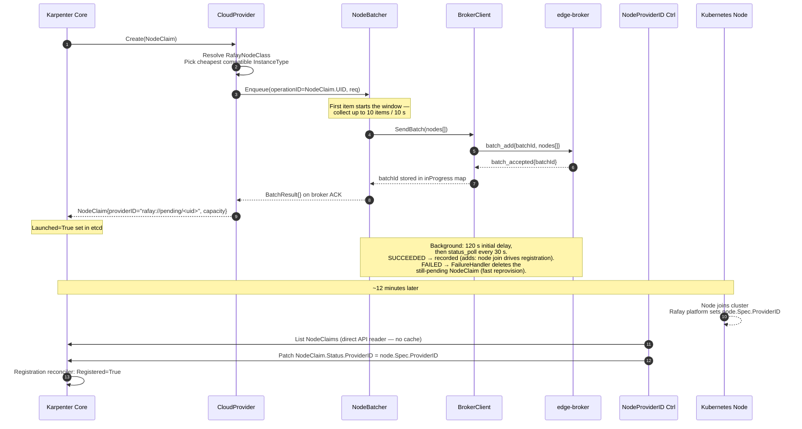

### 4.2 Scale-In (Node Deprovisioning)

```mermaid
sequenceDiagram
    autonumber
    participant K as Karpenter Disruption
    participant CP as CloudProvider
    participant NB as NodeBatcher
    participant BC as BrokerClient
    participant EB as edge-broker

    Note over K,CP: Karpenter calls Delete() on EVERY reconcile (~5 s)<br/>and releases the Node's finalizer ONLY on NodeClaimNotFoundError.
    K->>CP: Delete(NodeClaim)
    alt batcher.Succeeded("<uid>-remove")
        CP-->>K: NodeClaimNotFoundError — removal complete ✓<br/>(Karpenter releases the finalizer and finishes)
    end
    alt ProviderID is rafay://pending/<uid>
        CP->>CP: findNodeProviderID (apiReader)<br/>nodes by nodepoolname label; sku_name matched in code
        alt Real node found
            Note over CP: Use node.Spec.ProviderID
        else No node found
            CP->>NB: Cancel(NodeClaim.UID) — fire-and-forget cancel_ops<br/>(only still-ACCEPTED add op is cancelled)
            CP-->>K: NodeClaimNotFoundError
        end
    end
    CP->>NB: EnqueueRemove(operationID=UID+"-remove", req{providerID, pool, sku})
    alt operationID already in flight at broker
        NB-->>CP: BatchResult{} immediately — NOTHING re-sent<br/>(suppresses the duplicate batch each 5 s reconcile would push)
    else first send
        Note over NB: Same 10 item / 10 s collection;<br/>removes go out as their own batch
        NB->>BC: SendBatchRemove(nodes[])
        BC->>EB: batch_remove{batchId, nodes[]}
        EB-->>BC: batch_accepted{batchId}
        NB-->>CP: BatchResult{} on broker ACK
    end
    CP-->>K: nil — Karpenter requeues in 5 s and calls Delete() again
    Note over EB: Processor applies NEGATIVE pool+sku deltas<br/>(clamped at 0). PaaS chooses which physical<br/>machine is removed — provider_id carried for<br/>future targeted removal.
    EB-->>NB: status_poll → SUCCEEDED
    Note over NB: Recorded in `succeeded`; the NEXT Delete() call<br/>(≤5 s later) converges on NodeClaimNotFoundError.
```

> **Node existence cannot be the completion signal.** During termination **Karpenter itself holds the Node object alive with its own finalizer**, and only drops it once `Delete()` reports the instance gone. "Is there still a Node with this providerID?" is therefore circular and never converges — the broker's SUCCEEDED result is the only external signal that terminates the loop. `Delete()` previously returned `nil` forever after broker ACK, so NodeClaims and Nodes stayed `Terminating` indefinitely.

### 4.3 Pod Restart / Crash Recovery

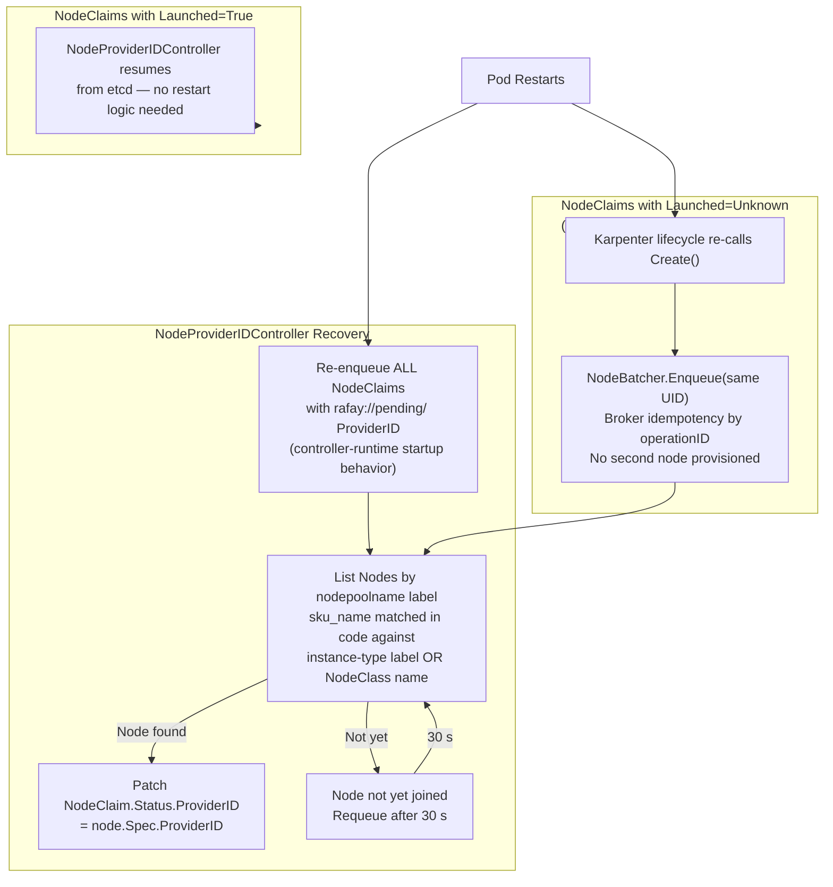

### 4.4 BrokerClient Connection Lifecycle

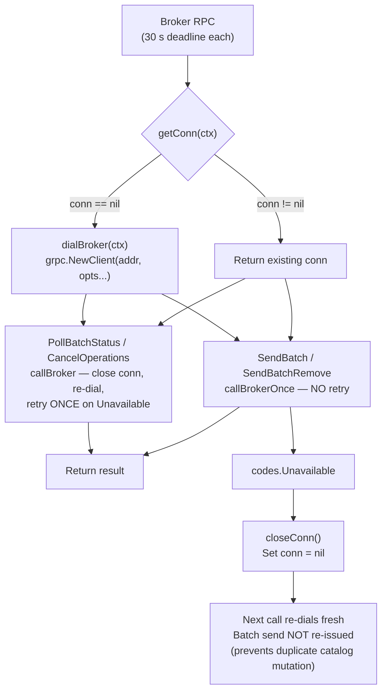

### 4.5 NodeClass Readiness

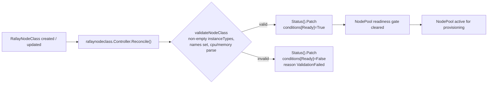

---

## 5. Core Packages

### 5.1 NodeBatcher Internals

The `NodeBatcher` decouples individual `Create()`/`Delete()` calls from the batch gRPC protocol, providing deduplication, in-flight suppression, and efficient grouping. Callers unblock at **broker ACK**; the status poller tracks broker-side completion in the background — and for removes that completion is what lets `Delete()` converge.

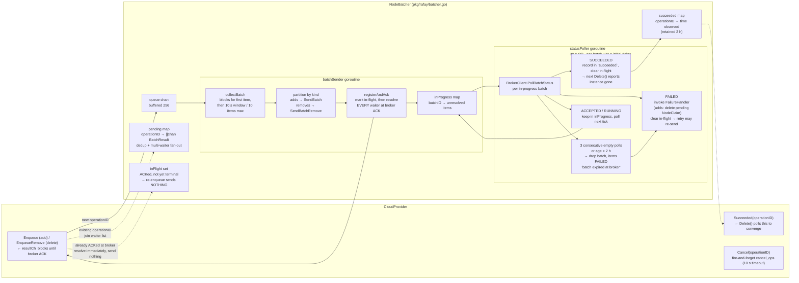

**Lock order (when both locks needed):** `mu → pendingMu`

**In-flight suppression.** Karpenter re-invokes `Delete()` **every 5 seconds** for the whole life of a node removal. Every operationID the broker has ACKed and not yet driven terminal is held in `inFlight`; re-enqueueing one resolves the caller immediately instead of sending a duplicate batch. Without this, each 5 s reconcile pushed another remove batch at the broker, flooding its **global** 64-slot queue with copies of the same removal. Operations leave the set as soon as they go terminal, so a genuine retry after a FAILED is never suppressed.

**Multi-waiter fan-out.** `pending` maps an operationID to a **slice** of result channels, so every caller waiting on the same operation is resolved together. With a single buffered channel per operation, only the first waiter could consume the result and the rest blocked until their context was cancelled.

### 5.2 Batch Stream Protocol

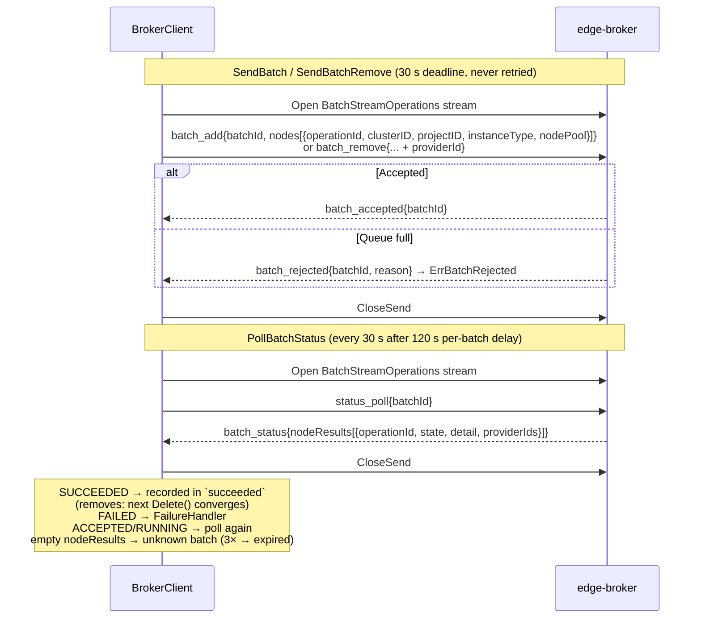

### 5.3 Remove and Cancel Protocol

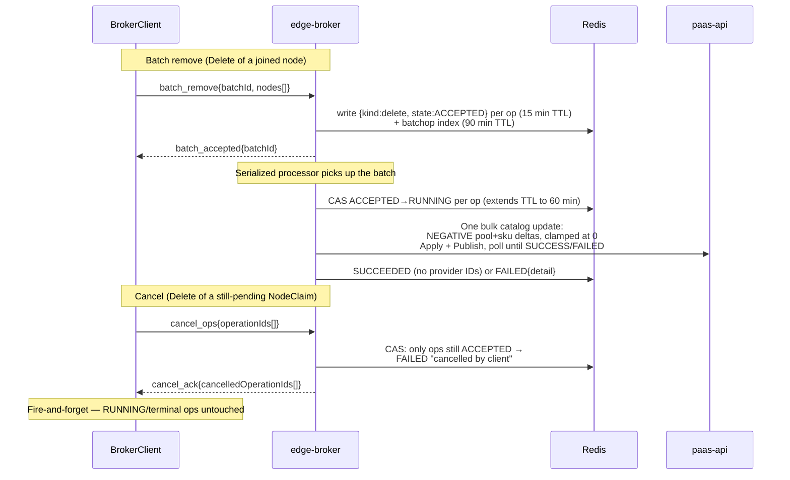

> **Platform limitation:** the worker-node catalog is declarative (a desired count per pool+SKU), so a remove is a count decrement and the PaaS platform decides which physical machine is retired. `provider_id` is carried on `batch_remove` items so a future targeted-removal API can be adopted without a protocol change.

### 5.4 CloudProvider Interface

| Method | Behavior |
|---|---|
| `Create(NodeClaim)` | Resolves `RafayNodeClass` → filters compatible instance types → **stable-sorts by synthetic price and picks the cheapest** (spec order on ties) → enqueues to `NodeBatcher` → blocks until broker ACK → returns `NodeClaim{providerID="rafay://pending/<uid>", capacity, labels}`. `NodeProviderIDController` later patches the real ProviderID. |
| `Delete(NodeClaim)` | **Converges across repeated calls.** Returns `NodeClaimNotFoundError` as soon as the batcher reports the remove op (`<uid>-remove`) SUCCEEDED at the broker — the only signal that releases the Node's termination finalizer. Otherwise: if ProviderID is still pending, scans for a joined node by labels via the uncached `apiReader`, and if none has joined fires a best-effort `Cancel` of the add operation and returns `NodeClaimNotFoundError`. Otherwise enqueues `EnqueueRemove(UID+"-remove", …)` and returns `nil` at broker ACK; Karpenter requeues and calls `Delete` again in 5 s (the batcher suppresses the duplicate send). |
| `Get(providerID)` | For `rafay://pending/` prefix: returns minimal NodeClaim (provisioning in progress). Otherwise scans `NodeList` by `spec.providerID`. **Not** the termination completion signal — see §4.2. |
| `List()` | `ListNodes` unsupported → falls back to listing **every** k8s Node whose `spec.providerID` carries the `rafay://` prefix. **No cluster-ID filter** — see the note below. |
| `GetInstanceTypes(NodePool)` | Returns `RafayNodeClass.spec.instanceTypes` parsed with `resource.ParseQuantity`; each type carries one offering with a **synthetic price = 1.0 × vCPU + 0.125 × GiB memory**. Returns error if the list is empty or quantities are malformed. |
| `IsDrifted(NodeClaim)` | Always `("", nil)` — no drift detection; lifecycle managed by Rafay platform. |
| `Name()` | `"rafay"` |

`NewCloudProvider` takes both the cached `kubeClient` and the uncached `apiReader`, plus the cluster/project IDs read from `RAFAY_CLUSTER_ID` / `RAFAY_PROJECT_ID`. Those env values are the sole source of Rafay identity on every broker request — a `RafayNodeClass` cannot override them.

> **Why `List()` must not filter by cluster ID.** A real ProviderID is `rafay://<nodepoolname>/<sku_name>/<hostname>` — the first segment is the **node pool**, not a cluster ID (see §7). Comparing it against `RAFAY_CLUSTER_ID` can never match, so `List()` returned an empty slice. That is dangerous, not merely useless: Karpenter's core **garbage-collection controller deletes any `Registered` NodeClaim whose ProviderID is absent from `List()`**, so every managed node was torn down the moment it briefly went `NotReady`.

### 5.5 NodeProviderIDController

**Purpose:** Resolves the real `spec.providerID` for NodeClaims that have a synthetic pending ProviderID, and patches `NodeClaim.Status.ProviderID`.

**Why it exists:** `Create()` returns immediately after broker ACK (typically seconds) to stay within Karpenter's 5-minute `launchTimeout`. Nodes take ~12 minutes to join. The controller bridges this gap within the 60-minute `registrationTimeout` window.

**Reconcile flow:**

```
1. Skip if ProviderID does not start with "rafay://pending/" or NodeClaim is being deleted

2. Extract:
     nodePoolName ← nodeClaim.Labels[karpenter.sh/nodepool]
     skus         ← NodeClaimSKUs(nodeClaim) = {
                       nodeClaim.Labels[node.kubernetes.io/instance-type],  # SELECTED SKU
                       nodeClaim.Spec.NodeClassRef.Name }                   # legacy single-SKU

3. Read NodeClaimList from API server directly (apiReader, NOT cache)
     → build usedIDs set (prevents stale-cache double-assignment race)

4. List Nodes with label: nodepoolname=<nodePoolName>
     (sku_name is NOT a server-side selector — a NodeClaim may accept several values)

5. Find first unclaimed node where:
     • node.Labels[sku_name] ∈ skus
     • spec.providerID != "" and not in usedIDs
     • creationTimestamp > nodeClaim.creationTimestamp

6. If not found → Requeue after 30 s

7. Patch NodeClaim.Status.ProviderID = node.Spec.ProviderID  (optimistic lock)
     • Conflict → Requeue: true
     • NotFound → ignore (NodeClaim deleted during disruption)
```

**Key properties:**
- **`sku_name` matches the SELECTED instance type, not just the NodeClass name.** `node.sku_name` is the **platform's** SKU/instance-type name. A `RafayNodeClass` listing several `instanceTypes` — exactly the configuration cheapest-fit selection exists to serve — provisions a node whose `sku_name` is the *selected* type, which does not equal the NodeClass name. Matching on `NodeClassRef.Name` alone therefore **never resolved** such NodeClaims: they churned on the hourly registration timeout, orphaning a machine each cycle. A node now matches if its `sku_name` equals **either** the NodeClaim's `node.kubernetes.io/instance-type` label (stamped by `Create()` from the type it selected — the authoritative match) **or** the NodeClass name (legacy single-SKU convention). The same rule is applied by `CloudProvider.findNodeProviderID`.
- `MaxConcurrentReconciles: 1` — serializes read-decide-patch, preventing two NodeClaims from claiming the same node
- **Secondary watch on Nodes**: when a real Rafay node appears (non-empty `spec.providerID` + Rafay labels), matching pending NodeClaims are immediately enqueued — no waiting for the 30 s requeue timer
- **Stateless across restarts**: controller-runtime re-enqueues all `rafay://pending/` NodeClaims on startup automatically
- **`apiReader` vs `kubeClient`**: `usedIDs` always reads from API server to avoid stale informer cache

---

### 5.6 NodeAdoptionController

**Purpose:** Gives every worker node that already exists in the cluster a NodeClaim, so Karpenter manages the whole pool rather than only the nodes it provisioned itself.

**Why it exists:** a cluster is created with the node count from its catalog (`noOfSku: 3`), and those nodes carry `nodepoolname` / `sku_name` labels but no NodeClaim. Karpenter counts NodeClaims only, so an un-adopted pool reports `status.nodes: 0` — it provisions its full `limits` **on top of** the existing nodes, and `ValidateNodeDisruptable` refuses to consolidate them (*"node isn't managed by karpenter"*).

**`Reconcile` flow** (primary watch NodePool, secondary watch Node, `MaxConcurrentReconciles: 1`):

```
Skip if the NodePool is deleting or its nodeClassRef is not karpenter.rafay.io/RafayNodeClass

poolNodes  ← Nodes labelled nodepoolname=<pool>                 (informer cache)
claimList  ← every NodeClaim                                    (apiReader — uncached)
claimedIDs ← { status.providerID } ∪ { karpenter.rafay.io/adopted-provider-id }

log the counts: pool nodes, pool nodeclaims, cluster-wide worker nodes

per unclaimed node:
  ├─ skip control-plane / no sku_name / non-rafay:// providerID
  ├─ skip unless the NodeReady condition is True   (wait for it; the Node watch re-triggers)
  ├─ skip if a pending NodeClaim newer than the node could still take it
  ├─ skip if sku_name ∉ RafayNodeClass instanceTypes, or labels fail the pool's requirements
  ├─ patch Node: spec.providerID (only if empty), karpenter.sh/registered=true
  └─ create NodeClaim annotated karpenter.rafay.io/adopted-provider-id=<providerID>

requeue after 5m
```

**Key properties:**

- **Only Ready nodes are adopted** (`nodeutils.GetCondition(node, NodeReady).Status == True`, the same test `Initialization` uses). A NodeClaim for a NotReady node would be counted towards the pool's limits — while uninitialized, `StateNode.Capacity()` fills any resource the node does not report from the NodeClaim's, so for a node whose kubelet never reported the SKU's declared figures are the whole capacity — and could never reach `Initialized`. Nothing reaps it either: `Liveness` reaps only claims that failed to **register**, and garbage collection only claims absent from `List()`, which this one is not. Waiting is free: the Node watch fires on the status update that flips the condition. A node that goes NotReady *after* adoption keeps its claim. The gate sits above the ownership checks (so a still-booting node gets a quiet deferral instead of label warnings), which is why the `notReady` log counter excludes nodes already claimed.
- **No machine is provisioned.** Karpenter's `Launch` reconciler calls `Create()` for any NodeClaim that is not yet `Launched`; the adoption annotation makes `Create()` return that ProviderID with **no broker call**, so the catalog and `noOfSku` are untouched. The marker is an annotation set at create time, not a status pre-patch — status is a separate subresource, and a create-then-patch sequence leaves a window in which `Launch` would order a second node.
- **Idempotent through the status gap.** An adopted NodeClaim has no status until `Launch` runs, so `claimedIDs` includes the annotation as well as `status.providerID`; NodeClaims are read via `apiReader` because a just-created one is not in the informer cache. Without both, a second pass would adopt the same node twice.
- **Complementary to §5.5.** The `NodeProviderIDController` binds a node to a pending NodeClaim only when the node is *newer* than the claim; adoption therefore skips any node newer than a pending claim for the same pool+SKU. The two halves never contend for the same node.
- **Refuses what Karpenter would replace.** The adoptability check mirrors the drift sub-controller (`areRequirementsDrifted` + `instanceTypeNotFound`), so a mismatched node (arm64 in an amd64 pool, an unknown SKU) is warned about and left unmanaged instead of being adopted and then drained.
- **Does not disturb running workloads.** Pool taints are not copied onto the NodeClaim (`Registration` syncs them onto the node, and `NoExecute` would evict its pods); well-known labels are read from the node, and topology labels are omitted when the node has none, so the SKU's synthetic zone `default` never overwrites real topology. No `karpenter.sh/nodepool-hash` annotation is set, so a later NodePool edit does not mark every adopted node drifted.

---

## 6. Worker Node SKU Catalog

The Worker Node SKU is a JSON array variable (`"Worker Node SKU"`) on the `WorkspaceComputeInstance` spec. Each row describes a pool/SKU combination and its desired node count.

```json
[
  { "poolname": "worker-pool-amd", "skuname": "oci-inst",     "noOfSku": 3 },
  { "poolname": "worker-pool-arm", "skuname": "oci-inst-arm", "noOfSku": 1 }
]
```

| Field | Source | Meaning |
|---|---|---|
| `poolname` | `NodePool.metadata.name` | Identifies which node pool this row applies to |
| `skuname` | `RafayNodeClass.spec.instanceTypes[i].name` | The instance type / SKU to provision |
| `noOfSku` | Managed by edge-broker | Desired number of worker nodes for this pool+SKU |

**Scale-out:** the broker groups each add batch by pool+SKU and applies all increments in **one** Apply + Publish.
**Scale-in:** remove batches become **negative** deltas in the same bulk pass; a row count is **never driven below 0** (the clamp is logged in the before/after counts).

> **Note:** A positive delta for a `{poolname, skuname}` row that does not exist **appends a new row**; a negative delta for a missing row is skipped (nothing to decrement). Matching is case-insensitive on pool and SKU names.

### RafayNodeClass → Catalog Mapping

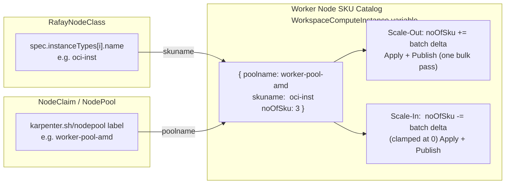

---

## 7. Operation State Machine

```mermaid
stateDiagram-v2
    direction TB

    [*] --> ACCEPTED : batch_add or batch_remove\nnew operationID (or retry after FAILED)

    ACCEPTED --> ACCEPTED : Idempotent replay\nre-enqueue without Redis write\n(restart recovery)

    ACCEPTED --> RUNNING : Batch processor claims op\n(Redis CAS — extends TTL to 60 min)

    ACCEPTED --> FAILED : cancel_ops → "cancelled by client"\nor queue full → "batch queue full; try again"\n(CAS — never clobbers RUNNING)

    RUNNING --> SUCCEEDED : Compute instance SUCCESS\nadd: provider IDs recorded\nremove: count decremented

    RUNNING --> FAILED : Compute instance FAILED\ndetail message stored in Redis

    SUCCEEDED --> [*]
    FAILED --> [*]
```

Replay rules when an `operation_id` already exists in Redis: **RUNNING/SUCCEEDED** → skip (a live processor owns it / already done); **ACCEPTED** → re-enqueue without touching Redis; **FAILED** → overwrite with ACCEPTED (client retry). An ACCEPTED record that expires (15-min TTL, e.g. broker restarted before processing) is reported on the next poll as FAILED `"operation record expired"`.

**Batch lifecycle timing (client side):**

| Time | Action |
|---|---|
| `t = 0 s` | `SendBatch`/`SendBatchRemove` → recv `batch_accepted{batchId}` → **`resultCh` resolved — `Create()`/`Delete()` unblocks now** |
| `t = 0 – 120 s` | Per-batch initial delay — no polls |
| `t ≈ 120–150 s` | First `status_poll{batchId}` on the next 30 s tick |
| `t = +30 s, +60 s, …` | Subsequent polls every 30 s |
| terminal | `SUCCEEDED` → recorded in `succeeded` + cleared from `inFlight` (**removes: the next `Delete()` converges on this**; adds: registration is driven by the node joining) · `FAILED` → `FailureHandler` (adds: delete the still-pending NodeClaim) + cleared from `inFlight` so a retry can re-send |
| expiry | 3 consecutive empty polls or batch age > 2 h → batch dropped, remaining items FAILED `"batch expired at broker"` → `FailureHandler` |

---

## 8. NodeClaim Registration Timeline

```mermaid
sequenceDiagram
    participant TL as Timeline

    Note over TL: t = 0 s<br/>CloudProvider.Create() called

    Note over TL: t ≈ 5 s<br/>Broker ACK received<br/>Create() returns NodeClaim{providerID="rafay://pending/<uid>"}<br/>Launched=True written to etcd

    Note over TL: t ≈ 6 s<br/>Karpenter registration reconciler sets Registered=Unknown<br/>60-minute registrationTimeout timer starts

    Note over TL: t = 5 – 125 s<br/>NodeBatcher: 120 s initial poll delay

    Note over TL: t ≈ 125 s, then every 30 s<br/>status_poll (RUNNING → SUCCEEDED;<br/>FAILED would delete the pending NodeClaim via FailureHandler)

    Note over TL: t ≈ 12 min<br/>Node joins cluster<br/>Rafay platform sets node.Spec.ProviderID

    Note over TL: t ≈ 12 min  (triggered by Node watch)<br/>NodeProviderIDController patches<br/>NodeClaim.Status.ProviderID = node.Spec.ProviderID

    Note over TL: t ≈ 12 min<br/>Karpenter registration reconciler: Registered=True<br/>48-minute margin remaining before 60-min timeout fires
```

> **Note:** The `registrationTimeout` in `sigs.k8s.io/karpenter` has been patched to **60 minutes** (upstream default is 15 minutes). This is achieved via a local module fork with a `replace` directive in `go.mod`. Nodes join at ~12 minutes, giving a 48-minute safety margin instead of 3 minutes. Broker-side **FAILED** provisions do not wait for this timer — the batcher's `FailureHandler` deletes the pending NodeClaim within one poll interval, so Karpenter reprovisions in seconds.

### Timeout Summary for Node Join

| Timer | Value | Owner | What fires on expiry |
|---|---|---|---|
| `launchTimeout` | 5 min | Karpenter upstream | Delete NodeClaim if not Launched |
| `registrationTimeout` | **60 min** (patched) | Karpenter upstream (local fork) | Delete NodeClaim if not Registered |
| `maxBatchAge` (poller) | 2 h | `pkg/rafay/batcher.go` | Unresolved batch items treated as FAILED → `FailureHandler` |
| Broker Redis op TTL | 15 min (ACCEPTED) / 60 min (RUNNING+) | edge-broker (server-side) | Operation record expires → polls report FAILED |

---

## 9. Identity and Security

### mTLS Client Certificate

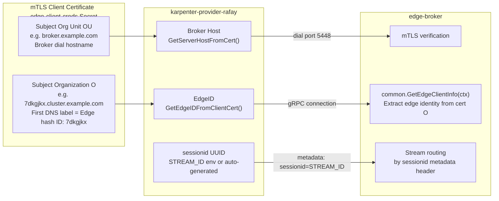

Both `karpenter-provider-rafay` and `edge-client` use the **same certificate material** (`client.crt`, `client.key`, `ca.crt`) from the `edge-client-creds` Secret mounted at `/opt/rcloud/certs/`.

### Concurrency Controls

| Layer | Mechanism | Purpose |
|---|---|---|
| **Broker** | Serialized batch queue — single processor goroutine, one batch at a time | Catalog mutations never overlap per broker pod |
| **Broker** | Redis CAS (`WATCH`/`MULTI`/`EXEC`) on ACCEPTED→RUNNING and cancel transitions | A cancel can never clobber a concurrent claim of the op (and vice versa) |
| **NodeProviderIDController** | `MaxConcurrentReconciles: 1` + `apiReader` | Prevents two NodeClaims from claiming the same node |
| **NodeBatcher** | `pending` map deduplication by `operationID` | Prevents duplicate batch items for the same NodeClaim (adds and removes alike) |

---

## 10. Provider ID Format

### Synthetic Pending (pre-join)

```
rafay://pending/<nodeclaim-uid>
```

Set by `Create()` immediately after broker ACK. Signals `NodeProviderIDController` that this NodeClaim is awaiting real ProviderID assignment. The `<nodeclaim-uid>` is the Kubernetes UID of the NodeClaim.

### Real Format (post-join, set by Rafay platform)

```
rafay://<nodepoolname>/<sku_name>/<hostname>
```

**Example:** `rafay://worker-pool-amd/oci-inst/payes-test-10-k97psrhs-w1-e6a5c`

| Segment | Source | Meaning |
|---|---|---|
| `nodepoolname` | Rafay platform | The **node pool** — matches the `nodepoolname` node label and the `karpenter.sh/nodepool` NodeClaim label. **This is not a cluster ID.** |
| `sku_name` | Rafay platform | The **platform's SKU / instance-type name** — matches the `sku_name` node label, and on the NodeClaim the `node.kubernetes.io/instance-type` label (the type `Create()` selected) or, under the legacy single-SKU convention, `spec.nodeClassRef.name` |
| `hostname` | Rafay platform | Kubernetes node name |

The Rafay platform sets `spec.providerID` on the node when it joins. The provider **never constructs** this format — it only reads it from `node.Spec.ProviderID`.

> ⚠️ **The first segment is the node pool, NOT a cluster ID.** `ParseProviderID` (`pkg/rafay/providerid.go`) splits a Rafay provider ID into its first path segment (`nodePoolName`) and the remainder (`"<sku_name>/<hostname>"`). It is **not** used to filter nodes by cluster: `listNodesFromKube` used to compare that first segment against `RAFAY_CLUSTER_ID`, which can never match, so `List()` always returned empty — and the core garbage-collection controller then deleted any `Registered` NodeClaim whose node briefly went `NotReady`. The cluster-ID filter is gone (see §5.4). A synthetic pending ID parses structurally with `nodePoolName == "pending"`; callers that must distinguish pending IDs check `PendingProviderIDPrefix` instead.

### ProviderID Lifecycle

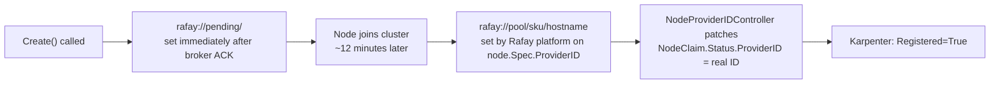

---

## 11. Idempotency and Resilience

### Operation ID

Every operation is keyed by the NodeClaim UID: adds use `NodeClaim.UID` directly, removes use `NodeClaim.UID + "-remove"`. The UID is:
- **Stable across provider restarts** — Karpenter reuses the same NodeClaim object and UID on retry after a crash
- **Unique per desired node** — prevents double-provisioning (or double-decrementing) for the same logical node

When the broker receives a batch item with an `operation_id` that already exists in Redis:
- **RUNNING / SUCCEEDED:** skip — a live processor owns it or it already finished
- **ACCEPTED:** re-enqueue without touching Redis (restart recovery; harmless because the processor only claims ops via the ACCEPTED→RUNNING CAS)
- **FAILED:** retry path — record rewritten to ACCEPTED and re-processed

### Crash Safety Matrix

| State at pod restart | `Launched` in etcd | Broker knows? | Recovery path |
|---|---|---|---|
| Item in queue, not sent | `Unknown` | No | Karpenter re-calls `Create()` → fresh first request |
| Batch sent, awaiting ACK | `Unknown` | Maybe | Karpenter re-calls `Create()` → broker idempotency by operationID |
| Broker ACK'd, `Launched=True` set | `True` | Yes | `NodeProviderIDController` resumes from etcd; broker processes the batch independently |
| Real ProviderID patched | `True` | Yes | Fully stable — no action needed |

Removes recover the same way: Karpenter retries `Delete()` as long as the node object exists, and the `-remove` operationID dedups at both the batcher and the broker.

### Retry Policy per RPC

- `SendBatch` / `SendBatchRemove` use `callBrokerOnce` — **never retried**. On `codes.Unavailable` the stale connection is closed so the next call re-dials clean, but the batch is not re-issued (retrying risks duplicating the catalog mutation). Recovery is via application-level paths: Karpenter re-calls `Create()`/`Delete()` with the same UID → broker idempotency.
- `PollBatchStatus` / `CancelOperations` use `callBroker` — closed, re-dialed and **retried once** on `Unavailable`. Both are safe to repeat: the poll is read-only and the cancel is CAS-guarded.

### Best-Effort Cancellation

Deleting a NodeClaim whose node never joined fires `Cancel(UID)`: a fire-and-forget `cancel_ops` (own 10 s timeout, detached from the caller's context). Only operations **still ACCEPTED** at the broker are transitioned to FAILED `"cancelled by client"`; an add that is already RUNNING completes, and the eventually-joined node is reclaimed by normal Karpenter lifecycle.

---

## 12. Timeouts Reference

| Layer | Constant | Value | Location |
|---|---|---|---|
| Batch: initial wait before first poll (per batch) | `defaultInitialDelay` | 120 s | `pkg/rafay/batcher.go` |
| Batch: interval between status polls | `defaultPollInterval` | 30 s | `pkg/rafay/batcher.go` |
| Batch: collection window (starts at first item) | `defaultBatchWindow` | 10 s | `pkg/rafay/batcher.go` |
| Batch: max items per batch | `defaultMaxBatchSize` | 10 | `pkg/rafay/batcher.go` |
| Batch: max tracked age of a sent batch | `maxBatchAge` | 2 h | `pkg/rafay/batcher.go` |
| Batch: empty polls before declaring batch unknown | `maxConsecutiveEmptyPolls` | 3 | `pkg/rafay/batcher.go` |
| Batch: how long a SUCCEEDED operationID is remembered (drives `Delete()` convergence) | `succeededRetention` | 2 h | `pkg/rafay/batcher.go` |
| Cancel: fire-and-forget broker cancel deadline | `cancelTimeout` | 10 s | `pkg/rafay/batcher.go` |
| Karpenter: `Delete()` retry interval while a node is terminating | `awaitInstanceTermination` requeue | 5 s | Karpenter core `pkg/controllers/node/termination/controller.go` |
| Broker: ACCEPTED record TTL | `karpenterBatchAcceptedTTL` | 15 min | `pkg/context/karpenter_batch_stream.go` |
| Broker: RUNNING / FAILED record TTL | `karpenterBatchRunningTTL` | 60 min | `pkg/context/karpenter_batch_stream.go` |
| Broker: SUCCEEDED tombstone TTL (refreshed on re-send) | `karpenterBatchSucceededTTL` | **24 h** | `pkg/context/karpenter_batch_stream.go` |
| Broker: batchID→opIDs index TTL | `karpenterBatchOpTTL` | 90 min | `pkg/context/karpenter_batch_stream.go` |
| Per-RPC broker deadline (send/poll/cancel) | `brokerCallTimeout` | 30 s | `pkg/rafay/brokerclient.go` |
| NodeProviderIDController: requeue when no node | `nodeWaitRequeueTime` | 30 s | `pkg/controllers/nodeproviderid/controller.go` |
| Headroom: safety resync | `resyncInterval` | 5 min | `pkg/controllers/headroom/controller.go` |
| NodeClaim launch timeout | `launchTimeout` | 5 min | Karpenter upstream (fork) |
| NodeClaim registration timeout | `registrationTimeout` | **60 min** (patched from 15 min) | Karpenter core `pkg/controllers/nodeclaim/lifecycle/liveness.go` |
| gRPC keepalive ping | `ClientParameters.Time` | 5 min | `pkg/broker/conn.go` |
| gRPC keepalive timeout | `ClientParameters.Timeout` | 30 s | `pkg/broker/conn.go` |
| gRPC keepalive without streams | `PermitWithoutStream` | false | `pkg/broker/conn.go` |
| gRPC max message size | — | 20 MB | `pkg/broker/conn.go` |
| Broker: Redis op TTL while ACCEPTED | `karpenterBatchAcceptedTTL` | 15 min | edge-broker `karpenter_batch_stream.go` |
| Broker: Redis op TTL once RUNNING / terminal | `karpenterBatchRunningTTL` | 60 min | edge-broker `karpenter_batch_stream.go` |
| Broker: batchID→opIDs index TTL | `karpenterBatchOpTTL` | 90 min | edge-broker `karpenter_batch_stream.go` |
| Broker: batch processor deadline | — | 50 min | edge-broker `processBatchAdd` / `processBatchRemove` |
| Broker: compute-instance poll interval | — | 30 s | edge-broker `karpenter_node_lifecycle.go` |

---

## 13. Configuration Reference

### TLS / Connectivity

| Variable | Default | Description |
|---|---|---|
| `CERT_FOLDER` / `EDGE_CLIENT_CERT_FOLDER` | — | Directory with `client.crt`, `client.key`, `ca.crt` for mTLS |
| `SERVER_PORT` / `EDGE_CLIENT_SERVER_PORT` | `5448` | TLS gRPC port to edge-broker |
| `EDGE_BROKER_GRPC_INSECURE` | `false` | `true` = plaintext gRPC. ⚠️ **Not usable for batch operations** — the broker derives the edge id from the mTLS client certificate, so `BatchStreamOperations` on the plaintext listener is rejected with `ErrorInvalidPeer`. Keep `false`. |
| `EDGE_BROKER_GRPC_PORT` | `5449` | Port when `EDGE_BROKER_GRPC_INSECURE=true` (see the caveat above) |
| `EDGE_BROKER_GRPC_HOST` | (from cert OU) | Override broker dial host (required when insecure + no cert) |

Invalid (non-numeric) port values log a warning and fall back to the default instead of being silently ignored.

### Identity / Routing

| Variable | Default | Description |
|---|---|---|
| `EDGE_ID` | (from cert Subject O) | Logging label; warns if it disagrees with the cert |
| `STREAM_ID` | (auto UUID v4) | gRPC `sessionid` metadata header — auto-generated if unset |
| `RAFAY_CLUSTER_ID` | — | Rafay cluster ID stamped on every broker add/remove payload. Sole source — no per-NodeClass override exists. |
| `RAFAY_PROJECT_ID` | — | Rafay project ID stamped on every broker add/remove payload, when the platform requires it. Sole source. |

### Controller Behavior

| Variable | Default | Description |
|---|---|---|
| `LEADER_ELECTION_NAMESPACE` | (unset; deployment sets `karpenter`) | Namespace for leader-election Lease objects |
| `DISABLE_LEADER_ELECTION` | `false` | Disable leader election (local dev) |
| `HEADROOM_NAMESPACE` | `karpenter` | Namespace where headroom Deployments (pause pods) are created |
| `HEADROOM_CONFIG_NAMESPACE` | = `HEADROOM_NAMESPACE` | Namespace of the `headroom-policy` ConfigMap |

> **Why `karpenter` namespace for leader election?** Rafay's platform webhook blocks Lease writes in `rafay-system`. The controller uses `karpenter` namespace to avoid this restriction.

### Headroom Policy ConfigMap

The headroom controller reads a `headroom-policy` ConfigMap (data key `policy`, see `examples/policy_configmap.yaml`). Per pool: buffer fractions `cpu`/`memory`/`gpu`, per-pod slice sizes `podCPU`/`podMemory`/`podGPU` (defaults `500m`/`512Mi`; GPU buffers require an explicit `podGPU`), a `minPods` cold-start floor, and optional `tolerations` (**no blanket `Exists` toleration is added**). Replicas = max over configured resources of `ceil(fraction × Σ ready-node allocatable / per-pod size)`, floored at `minPods` and **clamped at 5000** (`maxHeadroomReplicas`) so a typo in a per-pod size cannot flood the cluster or overflow the `int32` replica count. Per-pod sizes below `1m` CPU / `1Mi` memory and duplicate pool names are rejected at parse time.

Robustness properties worth knowing:

- **A ConfigMap parse error keeps the buffer up.** A YAML typo makes `Reconcile` return an error *before* any garbage collection runs. It must never read as "no pools configured": falling through with an empty pool list would tear down **every** headroom Deployment in the cluster over one bad character. A ConfigMap that parses cleanly and declares *no* pools is a legitimate "headroom off" policy and does remove the Deployments.
- **Data keys are scanned deterministically** (`policy`, then `config`, then all other keys sorted by name). Go map iteration is randomized, so an unsorted scan would let the applied policy flap between reconciles when two keys both declare pools.
- **Steady-state reconciles issue no Deployment Updates.** The reconciler mutates only the fields it owns, in place on the fetched pod template, so it does not clobber API-server defaults and then "differ" from the stored object on every pass.
- **The `rafay-headroom` PriorityClass is ensured on every Reconcile**, not just at startup (without it the pause pods are rejected at admission, silently disabling headroom). Its `Value` is immutable and the controller holds no update verb, so a pre-existing class with a different value or `preemptionPolicy` is reported with a **loud warning every reconcile** rather than passing silently — a non-negative value makes headroom pods un-preemptable, and `preemptionPolicy != Never` lets them evict real workloads. Fixing it means deleting the class.

> ⚠️ **GPU headroom reserves capacity on the pool's EXISTING GPU nodes only — it cannot cold-start a GPU pool or drive scale-out.** The Rafay cloudprovider's instance types advertise only `cpu`/`memory`/`pods` in their `Capacity`, never `nvidia.com/gpu` or `amd.com/gpu`, so Karpenter cannot satisfy a pending pod that requests a GPU extended resource and will not provision a node for it. The GPU resource name is derived from the GPU nodes the pool already has; on a pool with no GPU nodes the `podGPU` request is **dropped with a warning** rather than guessed (a guess would only strand the pause pod in `Pending` forever, and would be wrong outright on an `amd.com/gpu` pool). Use `minPods` with a cpu/memory-sized pod to cold-start a GPU pool; the GPU buffer applies once nodes exist.

> **Required:** NodePools used with headroom must set `disruption.consolidationPolicy: WhenEmpty`. Pause pods keep buffer nodes non-empty, so `WhenEmptyOrUnderutilized` would consolidate them away and the replacement pods would scale them back up — an endless oscillation. The examples set `WhenEmpty` + `consolidateAfter: 5m`.

### Kubernetes Secrets

| Secret | Namespace | Contents |
|---|---|---|
| `edge-client-creds` | `rafay-system` | `client.crt`, `client.key`, `ca.crt` — mounted at `/opt/rcloud/certs/` |
| `karpenter-provider-rafay` | `rafay-system` | Optional `RAFAY_CLUSTER_ID` / `RAFAY_PROJECT_ID` via `envFrom` |

RBAC (see `config/deploy/rbac.yaml`) additionally grants full write on `apps/deployments` and `create` on `scheduling.k8s.io/priorityclasses` for the headroom controller.

### edge-broker (Control Plane)

| Variable | Default | Description |
|---|---|---|
| `EDGE_BROKER_SERVER_PORT` | `5448` | mTLS listener port |
| `EDGE_BROKER_CERT_FOLDER` | `/etc/rcloud/certs` | TLS certificate directory |
| `EDGE_BROKER_REDIS_ADDR` | `admin-redis:6379` | Redis address |
| `EDGE_BROKER_REDIS_DB` | `3` | Redis database index |
| `EDGE_HOST` | `edgesrv.rcloud-admin.svc.cluster.local` | Edge service address |
| `EDGE_PORT` | `50701` | Edge service port |
| `INFRA_API_SERVER_ADDR` | `infra-apiserver:7000` | Infra API server (v2 cluster resolution) |
| `WORKSPACE_SERVICE_ADDR` | `paas-api:6000` | PaaS workspace RPC service address |
| `PAAS_SERVICE_USERMETA_ID` | `edge-broker` | Service identity for PaaS calls |
| `PAAS_SERVICE_USERNAME` | `edge-broker` | Username for PaaS calls |
| `EDGE_BROKER_PAAS_WORKSPACE_NAME` | `system-catalog` | PaaS workspace name for compute instance lookup |

### RafayNodeClass CRD (Sample)

```yaml
apiVersion: karpenter.rafay.io/v1alpha1
kind: RafayNodeClass
metadata:
  name: oci-inst
spec:
  instanceTypes:
    - name: oci-inst         # must match "skuname" in Worker Node SKU catalog
      cpu: "8"
      memory: "16Gi"
      architectures: ["amd64"]
      operatingSystems: ["linux"]
```

The readiness controller validates every entry (non-empty name, parseable `cpu`/`memory`); a bad spec yields `Ready=False` with reason `ValidationFailed` instead of failing at `Create()` time.

---

## 14. Key Dependencies

| Module | Version | Role |
|---|---|---|
| `sigs.k8s.io/karpenter` | v1.14.1 (Rafay fork `github.com/RafaySystems/karpenter-rafay`, branch `rafay-release-v1.14.x`) | Core framework: operator, controllers, `CloudProvider` interface. Forked to patch `registrationTimeout` to 60 min. |
| `sigs.k8s.io/controller-runtime` | v0.23.3 | Reconciler infrastructure, Manager, typed client |
| `github.com/awslabs/operatorpkg` | (see go.mod) | Operator lifecycle, `status.Condition`, `controller.Controller` |
| `github.com/RafaySystems/edge-common` | replace → local | `rep.edge.v1` Karpenter batch protocol (add / remove / status / cancel) and generated Go |
| `google.golang.org/grpc` | v1.72.2 | gRPC client (`grpc.NewClient`, lazy connect) |
| `k8s.io/client-go` | v0.35.1 | Kubernetes client |
| `k8s.io/api`, `k8s.io/apimachinery` | v0.35.1 | Aligned with client-go / Karpenter |
| `github.com/samber/lo` | v1.52.0 | Functional helpers (`Filter`, `Map`, `Assign`) |
| `github.com/google/uuid` | v1.6.0 | UUID v4 for auto-generated `STREAM_ID` and batch IDs |

---

## 15. Design Decisions

### One batch protocol for adds and removes

Node-add requests are batched because multiple pods may become unschedulable simultaneously and Karpenter issues concurrent `Create()` calls. Removes ride the same `NodeBatcher` and the same `BatchStreamOperations` stream (as `batch_remove` frames in their own batches), so both directions share collection, deduplication, idempotency, status polling and failure handling. The former per-operation `KarpenterNodeService.StreamOperations` delete path has been removed.

### ACK-unblock for both Create() and Delete()

`Create()` blocks only until the broker acknowledges the batch (typically seconds), then returns `rafay://pending/<uid>`. This satisfies Karpenter's 5-minute `launchTimeout` without waiting for the node to actually join (~12 minutes); the `NodeProviderIDController` resolves the real `spec.providerID` within the 60-minute `registrationTimeout` window. No stream is held open for the duration of the work.

`Delete()` likewise returns at broker ACK — but it does **not** stop there, because Karpenter's termination controller re-invokes it on every reconcile and releases the Node's finalizer **only** on a `NodeClaimNotFoundError`. Actual departure is tracked by the status poller: it records the operationIDs the broker reports SUCCEEDED, and the next `Delete()` (≤5 s later) returns `NodeClaimNotFoundError`. The 5 s retry loop is cheap because the batcher suppresses duplicate sends for in-flight operations.

Node existence is deliberately **not** the completion signal: during termination Karpenter holds the Node object alive with its own finalizer, which it drops only once `Delete()` reports the instance gone — so polling for the Node's disappearance is circular and never converges.

### Removal is a catalog count decrement

The PaaS worker-node catalog is declarative (desired count per pool+SKU), so the broker applies removes as negative deltas clamped at 0 and **the platform chooses which physical machine is retired**. This is a platform limitation; `provider_id` is carried on every `batch_remove` item so a targeted-removal API can be adopted later without a protocol change.

### Best-effort cancel instead of a compensating remove

Deleting a NodeClaim whose node never joined used to have no safe remedy. Now the provider fires `cancel_ops` for the pending add: only an op still queued (ACCEPTED) at the broker is cancelled (CAS-guarded), so a provision that is already running is never half-undone — the joined node is reclaimed by normal lifecycle instead.

### FAILED provisions delete the pending NodeClaim

The status poller hands terminal FAILED results to a `FailureHandler`. For adds, the wired handler deletes the NodeClaim whose UID matches the operationID — only if it still carries a pending ProviderID and is not already being deleted — so Karpenter reprovisions within seconds instead of waiting out the 60-minute registration timeout. Remove failures are log-only: the operationID is cleared from the in-flight set, and Karpenter's ongoing `Delete()` retries re-send the removal (the broker rewrites the FAILED record to ACCEPTED).

SUCCEEDED results are **recorded**, not merely logged. For adds that is incidental — registration is driven by the node joining. For **removes** it is the convergence signal: it is what lets `Delete()` return `NodeClaimNotFoundError` and release the Node's termination finalizer.

### Synthetic pricing gives consolidation a gradient

The private cloud has no price list, so each instance type's single offering carries a synthetic price (1.0 per vCPU + 0.125 per GiB of memory). `Create()` picks the cheapest compatible type (stable sort — NodeClass spec order breaks ties) and Karpenter's consolidation can prefer replacing underutilized nodes with smaller ones.

### ProviderID resolved from Kubernetes Node, not broker response

Rather than relying on the broker to return a provider ID, the provider reads `node.Spec.ProviderID` directly from the Kubernetes node once it joins. This decouples the provider from the broker's response format and uses the node's own identity as the canonical identifier.

### NodeProviderIDController: single-threaded with uncached reads

`MaxConcurrentReconciles: 1` serializes the read-decide-patch cycle for node assignment. `apiReader` (direct API server reads, bypassing informer cache) ensures a just-patched ProviderID is visible to the next reconcile, preventing two pending NodeClaims from claiming the same node. `Delete()`'s `findNodeProviderID` uses the same uncached reader for the same reason.

### NodeClaims as sole source of truth

No in-memory state is load-bearing across a pod restart. NodeClaims in etcd are the sole source of truth. `NodeProviderIDController` recovers on startup by re-processing all existing `rafay://pending/` NodeClaims. Broker idempotency (per operationID) ensures no duplicate provisioning or removal.

### No retry on batch sends; bounded everything else

`SendBatch`/`SendBatchRemove` use `callBrokerOnce` — retrying a send that partially executed (catalog already mutated but response not received) would double-provision. `PollBatchStatus`/`CancelOperations` are safe to retry once. Every broker RPC carries a 30 s deadline, in-progress batches are dropped after 2 h or 3 consecutive empty status polls (items handed to the failure handler), and a broker-side queue-full condition is reported in-band (`batch_rejected`) without killing the stream.

### Headroom as preemptible Deployments

Proactive scale-out uses the proven cluster-overprovisioner pattern: one Deployment of negative-priority pause pods per pool, sized from the policy ConfigMap, spread across hostnames. Real workloads preempt the pause pods instantly; the ReplicaSet's pending replacements make Karpenter provision replacement capacity. This requires `consolidationPolicy: WhenEmpty` on participating NodePools (see [§13](#13-configuration-reference)).

### No broker query API

`GetNode` and `ListNodes` return sentinel errors; the provider falls back to listing Kubernetes `Node` objects filtered by `spec.providerID` prefix `rafay://`. The Kubernetes API is the ground truth for what is currently running.

### Parity with `edge-client`

TLS certificate path, broker host extraction, port environment variable names, keepalive parameters (5-min ping / 30 s timeout, no pings without active streams), max message size (20 MB), and `sessionid` UUID generation all mirror `edge-client` so the same certificate material and deployment patterns apply without additional configuration.
